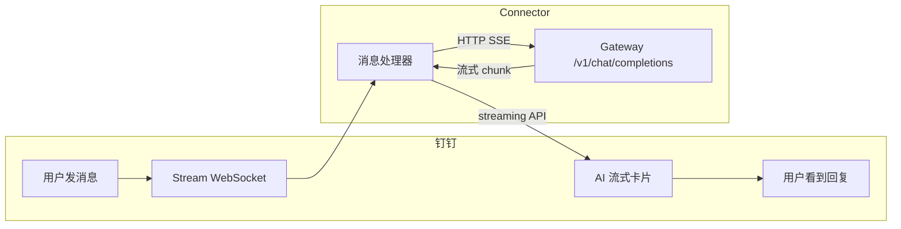

# dingtalk-moltbot-connector

将钉钉机器人连接到 [Moltbot](https://moltbot.com) / [Clawdbot](https://clawdbot.com) Gateway，支持 AI Card 流式响应和会话管理。

## 特性

- ✅ **AI Card 流式响应** - 打字机效果，实时显示 AI 回复
- ✅ **会话持久化** - 同一用户的多轮对话共享上下文
- ✅ **超时自动新会话** - 默认 30 分钟无活动自动开启新对话
- ✅ **手动新会话** - 发送 `/new` 或 `新会话` 清空对话历史
- ✅ **图片自动上传** - 本地图片路径自动上传到钉钉

## 两种实现

| | **TypeScript 插件** | **Python 独立连接器** |
|---|---|---|
| 运行方式 | Moltbot/Clawdbot 内置插件 | 独立进程 |
| 入口文件 | `plugin.ts` | `src/dingtalk_moltbot_connector/` |
| AI Card 流式 | 手动调用钉钉 REST API | 使用 `dingtalk-stream` SDK 内置方法 |
| 图片处理 | system prompt 引导 + **后处理自动上传** | system prompt 引导 |
| 安装方式 | `moltbot plugins install` | `pip install -e .` |

## 架构



## 效果


## 方式一：Moltbot / Clawdbot 插件（推荐）

### 1. 安装插件

```bash
# 远程安装
clawdbot plugins install https://github.com/DingTalk-Real-AI/dingtalk-moltbot-connector.git
# 后续插件升级
clawdbot plugins update dingtalk-connector

# 或本地开发模式
git clone https://github.com/DingTalk-Real-AI/dingtalk-moltbot-connector.git
clawdbot plugins install -l ./dingtalk-moltbot-connector
```

### 2. 配置

在 `~/.moltbot/moltbot.json`（或 `~/.clawdbot/clawdbot.json`）中添加：

```json5
{
  "channels": {
    "dingtalk-ai": {
      "enabled": true,
      "clientId": "dingxxxxxxxxx",       // 钉钉 AppKey
      "clientSecret": "your_secret_here", // 钉钉 AppSecret
      "gatewayToken": "",                 // 可选：Gateway 认证 token
      "gatewayPassword": "",              // 可选：Gateway 认证 password（与 token 二选一）
      "gatewayUrl": "",                   // 可选：Gateway URL，默认从 gateway.port 读取
      "sessionTimeout": 1800000,          // 可选：会话超时(ms)，默认 30 分钟
    }
  },
  "gateway": { // gateway通常是已有的节点，配置时注意把http部分追加到已有节点下
    "http": {
      "endpoints": {
        "chatCompletions": {
          "enabled": true
        }
      }
    }
  }
}
```

或者在Moltbot Dashboard页面配置


### 3. 重启 Gateway

```bash
clawdbot gateway restart
```

验证：

```bash
clawdbot plugins list               # 确认 dingtalk-connector 已加载
```

---

## 方式二：独立 Python 连接器

不依赖插件系统，独立运行的轻量桥接服务。

### 前置条件

- **Python** 3.10+
- **Gateway** 已在本地或远程运行
- **钉钉机器人** 已创建并配置为 Stream 模式

### 1. 安装并启动

```bash
git clone https://github.com/DingTalk-Real-AI/dingtalk-moltbot-connector.git
cd dingtalk-moltbot-connector
pip install -e .

# 交互式启动
python examples/quick_start.py
```

**代码集成：**

```python
from dingtalk_moltbot_connector import MoltbotConnector

connector = MoltbotConnector(
    dingtalk_client_id="dingxxxxxxxxx",
    dingtalk_client_secret="your_secret_here",
    gateway_url="http://127.0.0.1:18789",
)
connector.start()
```

---

## 创建钉钉机器人

1. 打开 [钉钉开放平台](https://open.dingtalk.com/)
2. 进入 **应用开发** → **企业内部开发** → 创建应用
3. 添加 **机器人** 能力，消息接收模式选择 **Stream 模式**
4. 开通权限：
   - `Card.Streaming.Write`
   - `Card.Instance.Write`
   - `qyapi_robot_sendmsg`
5. **发布应用**，记录 **AppKey** 和 **AppSecret**

## 配置参考

| 配置项 | 环境变量 | 说明 |
|--------|----------|------|
| `clientId` / `dingtalk_client_id` | `DINGTALK_CLIENT_ID` | 钉钉 AppKey |
| `clientSecret` / `dingtalk_client_secret` | `DINGTALK_CLIENT_SECRET` | 钉钉 AppSecret |
| `gatewayToken` / `gateway_token` | `MOLTBOT_GATEWAY_TOKEN` | Gateway 认证 token（可选） |
| `gatewayPassword` | — | Gateway 认证 password（可选，与 token 二选一） |
| `gatewayUrl` | — | Gateway 完整 URL（可选，默认从 gateway.port 构建） |
| `sessionTimeout` | — | 会话超时时间，单位毫秒（默认 1800000 = 30分钟） |

## 会话命令

用户可以发送以下命令开启新会话（清空对话历史）：

- `/new`、`/reset`、`/clear`
- `新会话`、`重新开始`、`清空对话`

## 项目结构

```
dingtalk-moltbot-connector/
├── plugin.ts                 # TS 插件入口（Moltbot/Clawdbot）
├── clawdbot.plugin.json      # Clawdbot 插件清单
├── moltbot.plugin.json       # Moltbot 插件清单
├── package.json              # npm 依赖（插件模式）
├── src/                      # Python 独立连接器
│   └── dingtalk_moltbot_connector/
│       ├── __init__.py
│       ├── connector.py      # MoltbotConnector 主类
│       ├── handler.py        # 钉钉消息处理器
│       ├── config.py         # 配置管理
│       └── media.py          # 图片上传辅助
├── examples/
│   ├── quick_start.py        # 交互式快速启动
│   ├── env_start.py          # 环境变量方式
│   └── custom_prompt.py      # 自定义 prompt
├── pyproject.toml            # Python 包配置
└── LICENSE
```

## 常见问题

### Q: 出现405错误

注意~/.clawdbot/clawdbot.json中要添加chatCompletions端点

```json5
{
  "gateway": { // gateway通常是已有的节点，配置时注意把http部分追加到已有节点下
    "http": {
      "endpoints": {
        "chatCompletions": {
          "enabled": true
        }
      }
    }
  }
}
```

### Q: 出现401错误

注意~/.clawdbot/clawdbot.json中鉴权token/password要对上


### Q: 钉钉机器人无响应

1. 确认 Gateway 正在运行：`curl http://127.0.0.1:18789/health`
2. 确认机器人配置为 **Stream 模式**（非 Webhook）
3. 确认 AppKey/AppSecret 正确

### Q: AI Card 不显示，只有纯文本

需要开通权限 `Card.Streaming.Write` 和 `Card.Instance.Write`，并重新发布应用。

### Q: 图片不显示

1. 确认 `enableMediaUpload: true`（默认开启）
2. TS 插件会自动后处理上传，检查日志 `[DingTalk][Media]` 相关输出
3. 确认钉钉应用有图片上传权限

## 依赖

**TypeScript 插件：**

| 包 | 用途 |
|----|------|
| `dingtalk-stream` | 钉钉 Stream 协议客户端 |
| `axios` | HTTP 客户端 |
| `form-data` | 图片上传 multipart |

**Python 连接器：**

| 包 | 用途 |
|----|------|
| `dingtalk-stream` | 钉钉 Stream 协议 + AI Card SDK |
| `httpx` | 异步 HTTP 客户端（SSE 流） |

## License

[MIT](LICENSE)
